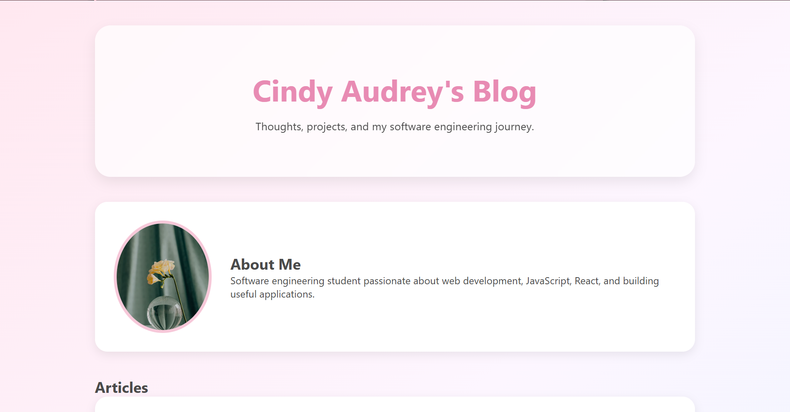
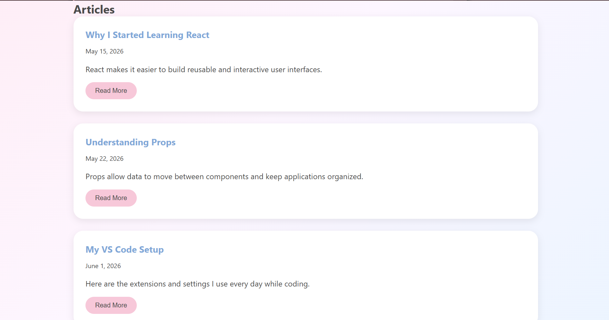

# Personal Blog Website

## Overview

This project is a React-based personal blog website that demonstrates component-based design, props, reusable UI elements, and basic testing with Jest.

## Features

* Header displaying the blog owner's name
* About section with profile image and description
* Dynamic article list
* Reusable Article component
* Social links section
* Jest test for prop rendering

## Component Structure

App
├── Header
├── About
├── ArticleList
│ └── Article
└── Links

## Installation

1. Clone the repository

```bash
git clone <repository-url>
```

2. Navigate into the project

```bash
cd personal-blog
```

3. Install dependencies

```bash
npm install
```

4. Start development server

```bash
npm run dev
```

5. Run tests

```bash
npm test
```

## Screenshots

Add screenshots to the screenshots folder and reference them here.

### Home Page




## Technologies Used

* React
* Vite
* JavaScript
* CSS
* Jest
* React Testing Library

## Author

Cindy Audrey
